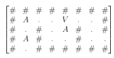
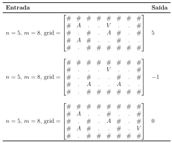

# Escape se for possível

Você está em uma caverna, representada por um grid $n \times m$. Quando ocorre um desmoronamento, a caverna começa a inundar a partir de uma ou mais posições. Seu objetivo é encontrar um caminho para fora da caverna antes que a água chegue até você.

### **Legenda do Grid**

* `V`: Sua posição inicial.
* `A`: Posição inicial da água.
* `.` (ponto): Espaço livre (pode ser percorrido por você e pela água).
* `#`: Parede (bloqueia você e a água).

### **Exemplo de Caverna**

Neste exemplo, é possível escapar em 5 segundos.
O único caminho minimal possível é mover-se duas vezes para a direita, duas vezes para baixo, uma vez para a direita, chegando na posição (4, 8), que é uma saída.

---

### **Regras**

* No instante inicial ($t = 0$), você está na posição `V` e a água está em todas as posições `A`.

* A cada instante de tempo ($t = 1, 2, 3, \dots$):

  **(a)** A água se propaga simultaneamente de todas as suas posições atuais para todas as posições adjacentes (cima, baixo, esquerda, direita) que não sejam paredes (`#`).

  **(b)** Você se move para uma posição adjacente (cima, baixo, esquerda, direita) que não seja uma parede (`#`).

* Você **não pode** se mover para uma célula que já esteja inundada.
  Além disso, você **não pode** se mover para uma célula no instante $t$ se a água também for alcançá-la no mesmo instante $t$. Você deve sempre ser mais rápido que a água.

* Para escapar, você deve alcançar **qualquer célula `.` na borda do grid** (primeira ou última linha, primeira ou última coluna).

Sua tarefa é desenvolver um algoritmo com complexidade de tempo **$O(n^2)$** que retorne o menor tempo (número de movimentos) necessário para escapar da caverna.
Se não for possível escapar, seu algoritmo deve retornar `-1`.

---

### **Restrições**

* $1 \le n, m \le 10^3$

---

### **Exemplos**

