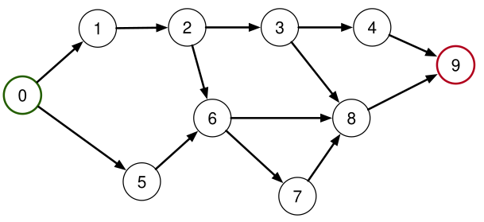

## Problema: Geração da Árvore Geradora de Caminhos Mínimos (SPT) em um DAG 🌳

O objetivo é **desenvolver um algoritmo** para encontrar a Árvore Geradora de Caminhos Mínimos (**Shortest Path Tree - SPT**) em um **Grafo Direcionado Acíclico (DAG)**, iniciando a busca a partir de uma **fonte única**.

A SPT é um subgrafo que contém os caminhos mais curtos da fonte para todos os outros vértices alcançáveis.

---

### 🗺️ Contexto do Grafo

* **Grafo:** $G = (V, E)$, um **Grafo Direcionado Acíclico (DAG)**.
* **Arestas:** Assumimos arestas **ponderadas** (embora os pesos não estejam visíveis no diagrama, são essenciais para o conceito de caminho "mínimo").
* **Fonte Única:** $s$ (no exemplo, o vértice **0**, marcado em verde).
* **Destino (Exemplo):** $t$ (no exemplo, o vértice **9**, marcado em vermelho).

### ✅ Premissas e Dicas

* **Ordem Topológica Disponível:** Considere que uma ordem topológica dos vértices do DAG é conhecida ou pode ser facilmente determinada.
* **Propriedades do DAG:** O algoritmo deve explorar as propriedades únicas de um DAG, que garantem que não há ciclos (eliminando a necessidade de verificar se um nó está na pilha de recursão para prevenir loops infinitos ou reabastecer a busca de forma complexa).

---

## Objetivo

Criar um algoritmo que, dado o DAG e a fonte $s$, determine o caminho mínimo (e seu custo) de $s$ para cada outro vértice $v \in V$, utilizando a **ordem topológica** para um processamento eficiente.

### Relação com Algoritmos Clássicos

* O problema é uma vvariação do problema de Caminho Mínimo de Fonte Única.
* Em grafos gerais, algoritmos como Dijkstra ou Bellman-Ford são usados.
* A natureza **acíclica** do DAG permite o uso de um método **mais eficiente** que os algoritmos de propósito geral.

---

## 📈 Exemplo Visual (DAG)

O diagrama representa um DAG onde o objetivo é encontrar o caminho mais curto de 0 para todos os outros nós (1, 2, 3, 4, 5, 6, 7, 8, 9).

$$
\text{Fonte} = 0 \quad (\text{Verde})
$$
$$
\text{Exemplo de Destino} = 9 \quad (\text{Vermelho})
$$