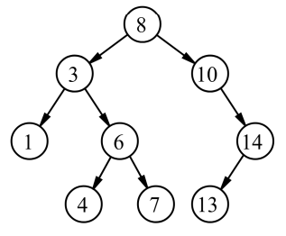

# Menor diferença absoluta

Dada uma árvore binária de busca (BST) $T$ com $n$ nós contendo inteiros, projete um algoritmo que encontre a menor diferença absoluta entre dois nós diferentes da árvore. O algoritmo deve ter complexidade $O(n)$ no pior caso

## Exemplos

Exemplo: Menor diferença absoluta sendo 1 (Vértices 6 e 7)