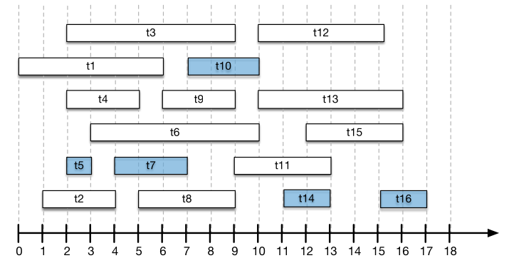

# Agendamento de Tarefas

Você recebeu um conjunto de $n$ tarefas, cada uma com um **tempo de início** e um **tempo de término**. Seu objetivo é selecionar o maior número possível de tarefas que possam ser executadas **sem sobreposição temporal** — ou seja, nenhuma tarefa pode estar em andamento ao mesmo tempo que outra escolhida.

Para isso, você deve escolher um subconjunto máximo de tarefas tal que, para quaisquer duas tarefas selecionadas $t_i$ e $t_j$, os intervalos $[start[t_i], end[t_i])$ e $[start[t_j], end[t_j])$ não se intersectem.

## Regras

- Cada tarefa $t_k$ possui:
  - Um tempo de início: $start[t_k]$
  - Um tempo de término: $end[t_k]$
- Duas tarefas não podem ser executadas simultaneamente.
- O objetivo é maximizar o número de tarefas selecionadas.

Desenvolva um algoritmo que encontre o maior subconjunto de tarefas compatíveis. A solução ótima deve rodar em **$O(n \log n)$**, onde $n$ é o número de tarefas.

## Exemplos

| Entrada (start, end) | Saída (número máximo de tarefas) | Conjunto escolhido |
|----------------------|----------------------------------|--------------------|
| $[(1, 3), (2, 5), (4, 6)]$ | $2$ | $[(1, 3), (4, 6)]$ |
| $[(7, 9), (0, 10), (4, 5), (8, 9)]$ | $2$ | $[(4, 5), (7, 9)]$ |
| $[(1, 2), (2, 3), (3, 4), (1, 3)]$ | $3$ | $[(1, 2), (2, 3), (3, 4)]$ |

